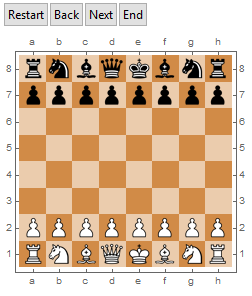

# Chess
A chessboard user interface created in Mathematica

## Installation
Load the Chess` package embedded in the file "Chess.wl" into a Mathematica notebook.
```mathematica
Needs["Chess`"]
```
## Usage
So far, no manual has been made, as the work is ongoing. A brief introduction to the capability of the package is however provided in the attached notebook "Chess_package.nb".
PGN files may be downloaded from the internet, e.g.:
```mathematica
kasparov = Import["http://chessproblem.my-free-games.com/PGN/Kasparov.zip", "*.pgn"][[1]];
```
and PGNs are found by
```mathematica
MakePGNfiles[kasparov]
549 PGN files are available (PGNfile[no])
```
Chosing one PGN file
Load the Chess` package embedded in the file "Chess.wl" into a Mathematica notebook.
```mathematica
PGNfile[540]
<|Event -> KasparovChess GP g/60, Site -> Internet INT,  Date -> 2000.02.13, Round -> 2.2, White -> Van Wely, Loek, 
Black -> Kasparov, Gary,  Result -> 0-1, WhiteElo -> 2646, BlackElo -> 2851,  ECO -> D46k, EventDate -> 2000.02.09,  
PGN -> {1.d4, Nf6, 2.Nf3, d5, 3.c4, e6, 4.Nc3, c6,  5.e3, Nbd7, 6.Qc2, Bd6, 7.Bd3, O-O, 8.O-O, dxc4,  9.Bxc4, a6, 
10.a4, c5, 11.Rd1, Qc7, 12.Ne4, Nxe4,  13.Qxe4, Nf6, 14.Qh4, cxd4, 15., Bd3, h6, 16.e4,  Nd7, 17.Bxh6, gxh6, 18.Rac1, 
Qd8, 19.Qxh6, Qf6,  20.Qxf6, Nxf6, 21.e5, Be7, 22.exf6, Bxf6, 23.Be4,  Rd8, 24.g4, Rb8, 25.g5, Bh8, 26.Ne1, Bd7, 
27.a5,  Ba4, 28., Rd2, d3, 29.Rxd3, Bb5, 30.Rxd8+, Rxd8,  31.Nf3, Bxb2, 32.Rc7, Ba3, 33.Rxb7, Rd1+, 34., Kg2, Bd6, 
35.Kh3, Rc1, 36.Nd4, Bf1+, 37.Bg2, Rc3+,  38.f3, Bd3, 39.Rb3, Rxb3, 40.Nxb3, Bb4, 41.f4, Bc4, 42.Nd4, Bxa5, 43.f5, 
Bc3, 44.Nc6, a5, 45.Nxa5,  Bxa5, 46.Be4, Bd5, 47., Bd3, Bc7, 48.f6, Bf4,  49.Kg4, Bxh2, 50.g6, e5, 51.Kf5, Be6+, 
52.Kg5,  Bf4+, 53.Kh5, Bd5, 54.Kg4, fxg6, 55.Bxg6, Be6+,  56.Kf3, Bg5}|>
```
The file is converted to a readable format for Mathematica by
```mathematica
pgn = PGNconvert[PGNfile[540]["PGN"]];
```
and the chessboard is displayed by
```mathematica
Chess[ShowBoard -> pgn, Interact -> False]
```


## Embedded features
Standard rules of piece moving are installed, including castling, en passant, and the conversion of pawns to officers (standard choice is queen).
Interactive use of the chessboard is included, also a PGN reading feature (see above). The chessboard may be displayed in different ways by changing default option values.

## Missing parts
A number of issues are still to be solved:

- The king is not allowed to move into an empty cell covered by pieces of opposite colour. However, the king is able to take pieces even when these are defended. Also, own pieces shadowing for potential attacks on the king are not hindered in moving, consequently putting the king in an illegal position.
- The game is not ended when the king is taken (even though it should be easy to implement :)
- There is no evaluation of the game.

## Observed bugs
- The 'back'-button in interactive modus does not convert major pieces (queens) back to pawns...

## Help is requested
Any contributions in improving existing code and adding features are appreciated. The package is free to be used as long as no commercial interests are involved.

You are welcome to contact me by email: arne.eide@gmail.com
